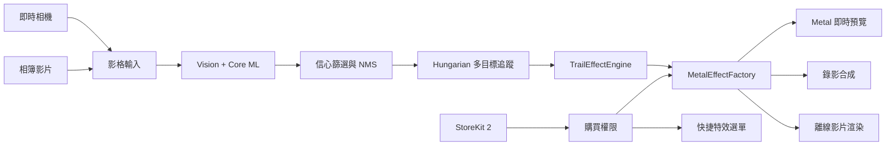
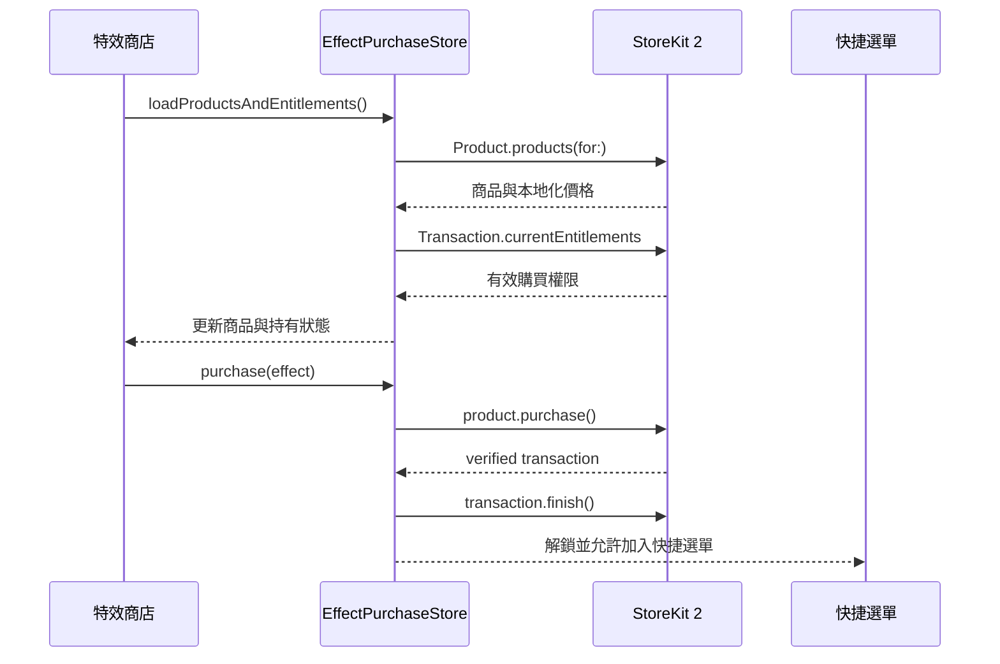

# BeyTail

> 以 Core ML、Vision、Hungarian 多目標追蹤與 Metal 粒子渲染打造的 iOS 陀螺辨識與動態尾跡特效應用。


BeyTail 是一套原生 iOS 應用，可從即時相機或相簿影片取得影像，執行陀螺物件偵測、多目標追蹤、軌跡生成與 Metal 特效渲染，並支援錄影、離線影片輸出、特效商店及快捷選單管理。

本專案僅使用 Apple 原生框架，目前沒有第三方套件相依。

---

## 主要功能

### 即時辨識與追蹤

* 使用 `AVFoundation` 擷取即時相機影格。
* 使用 `Vision` 與 `Core ML` 執行陀螺物件偵測。
* 自動讀取模型輸入尺寸，無法解析時使用 `640 × 640`。
* 內建信心分數篩選與 NMS 後處理。
* 使用 Hungarian Algorithm 進行多目標資料關聯。
* 維持穩定的 `trackId`、速度估計與主色平滑。
* 顯示辨識數量、推論 FPS、執行硬體與錄影時間。

### Metal 動態特效

* 使用 `MetalKit`、`MTKView` 與自訂 Shader 繪製即時尾跡。
* 每種進階特效由獨立的 `MetalEffect` 實作。
* 透過 `MetalEffectFactory` 建立對應 renderer。
* 切換特效時會重建 renderer，避免上一個特效的粒子狀態殘留。
* 即時特效更新頻率固定為 30 FPS，以維持粒子密度與動畫速度一致。
* 支援依陀螺主色動態生成軌跡顏色。

### 錄影與影片處理

* 錄製包含辨識特效的相機影片。
* 使用 `PhotosPicker` 選取相簿影片。
* 逐幀進行同步推論、追蹤與離線特效渲染。
* 顯示影片處理進度並支援取消。
* 渲染完成後可預覽、儲存至相簿或使用系統分享。
* 影片以檔案方式載入，避免將整支影片一次讀入記憶體。

### 特效商店

* 使用 StoreKit 2 載入非消耗型商品。
* 支援單一特效購買與限定特效包。
* 驗證交易並監聽 `Transaction.updates`。
* 使用 `Transaction.currentEntitlements` 同步已購買內容。
* 使用 `AppStore.sync()` 恢復購買。
* 未購買特效可進入 10 秒相簿影片試用。
* 試用結果僅供 App 內預覽，不能儲存或分享。

### 六格快捷特效選單

* 快捷選單最多放置 6 個已擁有特效。
* 支援新增、移除及拖曳排序。
* 移除後其餘項目會自動向前遞補。
* 不允許重複特效或中間空格。
* 購買權限失效時會自動移除未擁有項目。
* 排序結果透過 `UserDefaults` 的 `effectMenuIDs` 保存。
* 主畫面支援長按開啟選單及拖曳快速切換特效。

---

## 系統架構



### 主要資料流

1. `CameraManager` 或 `VideoFrameSource` 提供影格。
2. `InferenceEngine` 使用 Vision/Core ML 執行物件偵測。
3. 偵測結果經信心分數篩選與 NMS 處理。
4. `BeybladeTracker` 使用 Hungarian Algorithm 配對目標。
5. `TrailEffectEngine` 依 `trackId` 維護軌跡點與生命週期。
6. `MetalEffectFactory` 建立目前特效對應的 renderer。
7. `MetalTrailOverlayView` 將軌跡及粒子疊加到預覽畫面。
8. 錄影或離線影片流程將影像與特效合成後輸出。

---

## 技術棧

| 類別      | 技術                                    |
| ------- | ------------------------------------- |
| UI      | SwiftUI、UIKit                         |
| 相機與影片   | AVFoundation、AVKit                    |
| 相簿      | PhotosUI、Photos                       |
| 模型推論    | Core ML、Vision                        |
| 物件追蹤    | Hungarian Algorithm                   |
| GPU 特效  | Metal、MetalKit、Metal Shading Language |
| 非同步處理   | Swift Concurrency、DispatchQueue       |
| 狀態管理    | Combine、ObservableObject、AppStorage   |
| App 內購買 | StoreKit 2                            |
| 本地設定    | UserDefaults                          |
| 分享      | UIActivityViewController              |

---

## 專案結構

```text
beyblade/
├── beyblade.xcodeproj/
│
├── beyblade/
│   ├── Info.plist
│   ├── Assets.xcassets/
│   │
│   └── BeyTail/
│       ├── BeyTailApp.swift
│       │
│       ├── Camera/
│       │   └── CameraManager.swift
│       │
│       ├── ML/
│       │   ├── InferenceEngine.swift
│       │   └── BeybladeTracker.swift
│       │
│       ├── Models/
│       │   ├── DetectionResult.swift
│       │   ├── EffectType.swift
│       │   ├── EffectQuickMenuStore.swift
│       │   └── TrailPoint.swift
│       │
│       ├── Recording/
│       │   └── RecordingManager.swift
│       │
│       ├── StoreKit/
│       │   ├── BeyTail.storekit
│       │   └── EffectPurchaseStore.swift
│       │
│       └── UI/
│           ├── ContentView.swift
│           ├── MainViewModel.swift
│           ├── EditableEffectLibraryPage.swift
│           ├── EffectMenuView.swift
│           ├── QuickEffectMenuRow.swift
│           ├── VideoFrameSource.swift
│           ├── VideoPlayerView.swift
│           ├── VideoRenderPage.swift
│           │
│           ├── MetalEffects/
│           │   ├── Core/
│           │   │   ├── MetalEffectFactory.swift
│           │   │   ├── MetalTrailOverlayView.swift
│           │   │   └── Metal render context and protocols
│           │   │
│           │   └── Effects/
│           │       ├── GenericMetalEffect.swift
│           │       ├── WaveMetalEffect.swift
│           │       ├── MoneyMetalEffect.swift
│           │       ├── BladeMetalEffect.swift
│           │       ├── IceShatterMetalEffect.swift
│           │       ├── CrimsonLotusMetalEffect.swift
│           │       ├── DeathRayMetalEffect.swift
│           │       ├── EmeraldMetalEffect.swift
│           │       ├── InkWashMetalEffect.swift
│           │       └── SprayPaintMetalEffect.swift
│           │
│           └── pic/
│               └── icon/
│                   └── 特效圖示的 Metal 渲染元件
│
└── README.md
```

> Xcode 專案使用 File System Synchronized Group。新增至 `beyblade/` 目錄且未被排除的檔案，通常會自動出現在 Xcode 專案中，但仍應確認 Target Membership。

---

## 特效一覽

### 免費特效

| 識別值         | 顯示名稱 | Renderer             | 說明         |
| ----------- | ---- | -------------------- | ---------- |
| `lightning` | 閃電   | `GenericMetalEffect` | 黃色電流軌跡     |
| `fire`      | 火炎   | `GenericMetalEffect` | 紅色火焰軌跡     |
| `stardust`  | 星塵   | `GenericMetalEffect` | 使用陀螺主色生成軌跡 |

### 付費特效

| 識別值        | 顯示名稱 | Renderer                  | StoreKit Product ID                           |
| ---------- | ---- | ------------------------- | --------------------------------------------- |
| `wave`     | 滔天浪潮 | `WaveMetalEffect`         | `com.ahher0893.beyblade.effect.wave`          |
| `thunder`  | 金錢衝擊 | `MoneyMetalEffect`        | `com.ahher0893.beyblade.effect.money_impact`  |
| `vortex`   | 爆刃亂舞 | `BladeMetalEffect`        | `com.ahher0893.beyblade.effect.blade_dance`   |
| `dark`     | 狂暴冰裂 | `IceShatterMetalEffect`   | `com.ahher0893.beyblade.effect.ice_break`     |
| `crimson`  | 紅蓮破滅 | `CrimsonLotusMetalEffect` | `com.ahher0893.beyblade.effect.crimson_lotus` |
| `deathRay` | 破壞死光 | `DeathRayMetalEffect`     | `com.ahher0893.beyblade.effect.death_ray`     |
| `emerald`  | 翡翠破壞 | `EmeraldMetalEffect`      | `com.ahher0893.beyblade.effect.emerald`       |
| `inkWash`  | 水墨橫空 | `InkWashMetalEffect`      | `com.ahher0893.beyblade.effect.ink_wash`      |
| `spray`    | 噴漆塗鴉 | `SprayPaintMetalEffect`   | `com.ahher0893.beyblade.effect.spray_paint`   |

### 限定特效包

限定特效包的 Product ID：

```text
com.ahher0893.beyblade.effects.premium_pack
```

目前程式碼只會透過限定特效包解鎖以下四個特效：

1. 滔天浪潮
2. 金錢衝擊
3. 爆刃亂舞
4. 狂暴冰裂

限定特效包不會解鎖紅蓮破滅、破壞死光、翡翠破壞、水墨橫空或噴漆塗鴉。

本機 `BeyTail.storekit` 的參考價格為：

| 商品     | 本機測試價格 |
| ------ | -----: |
| 單一付費特效 |  NT$40 |
| 限定特效包  | NT$120 |

> 正式顯示價格由 App Store 回傳，不應在 UI 中寫死本機測試價格。

---

## 環境需求

| 項目                | 目前專案設定                                            |
| ----------------- | ------------------------------------------------- |
| 平台                | iOS / iPadOS                                      |
| Deployment Target | iOS 17.6                                          |
| Swift             | Swift 5                                           |
| Xcode             | 能開啟 `objectVersion 77` 的版本；目前專案由 Xcode 26.5 建立或更新 |
| 裝置                | iPhone 或 iPad                                     |
| GPU               | 支援 Metal 的 Apple 裝置                               |
| Core ML 模型        | 選用；缺少時自動進入 Mock 模式                                |
| 第三方套件             | 無                                                 |

建議使用實機測試下列功能：

* 相機畫面與方向處理
* Metal 特效效能
* 麥克風錄音
* 相簿讀寫
* StoreKit 購買與恢復購買

模擬器適合測試 UI、Mock 推論、商店頁與部分 StoreKit 本機流程，但不能完整代表實機效能。

---

## 安裝與執行

### 1. 取得專案

```bash
git clone https://github.com/ImChouOWO/beyblade.git
cd beyblade
open beyblade.xcodeproj
```

### 2. 設定簽章

在 Xcode 中選擇：

```text
Target: beyblade
→ Signing & Capabilities
→ Team
```

如需使用自己的 Apple Developer 帳號，請修改：

```text
PRODUCT_BUNDLE_IDENTIFIER
```

目前專案設定值為：

```text
ahher0893.beyblade
```

修改 Bundle Identifier 不會自動修改 StoreKit Product ID。正式上架前，必須同步確認：

* `EffectType.swift`
* `BeyTail.storekit`
* App Store Connect

三者使用完全相同的 Product ID。

### 3. 加入 Core ML 模型

`InferenceEngine` 預設尋找以下已編譯模型：

```text
best.mlmodelc
```

開發時可將下列任一格式拖入 Xcode：

```text
best.mlmodel
best.mlpackage
```

設定時確認：

* 模型名稱為 `best`
* `Target Membership` 已勾選 `beyblade`
* 模型位於 App Bundle
* 模型輸出格式符合 `InferenceEngine` 的解析邏輯

Xcode 會在建置時將模型編譯為 `best.mlmodelc`。

若 App Bundle 中找不到模型，應用會自動進入 Mock 模式，不會因缺少模型而無法啟動。

### 4. 設定 StoreKit 本機環境

專案已包含：

```text
beyblade/BeyTail/StoreKit/BeyTail.storekit
```

在 Xcode 中設定：

```text
Product
→ Scheme
→ Edit Scheme
→ Run
→ Options
→ StoreKit Configuration
→ BeyTail.storekit
```

### 5. 執行

1. 選擇 iPhone、iPad 或模擬器。
2. 建置並執行 `beyblade` target。
3. 首次啟動時允許相機、麥克風與相簿權限。
4. 若已加入 `best` 模型，應用會啟用真實推論。
5. 若沒有模型，畫面會顯示 `MOCK` 並產生模擬陀螺軌跡。

---

## 權限

專案需要以下用途描述：

```xml
<key>NSCameraUsageDescription</key>
<string>需要使用相機辨識陀螺並顯示軌跡特效</string>

<key>NSMicrophoneUsageDescription</key>
<string>需要使用麥克風錄製影片聲音</string>

<key>NSPhotoLibraryUsageDescription</key>
<string>需要讀取相簿中的影片進行陀螺辨識</string>

<key>NSPhotoLibraryAddUsageDescription</key>
<string>需要儲存錄影結果到相簿</string>
```

目前這些描述已設定於 Xcode Build Settings。若建立新的 target，需重新加入對應權限。

---

## 核心參數

### 推論參數

設定位置：

```text
beyblade/BeyTail/ML/InferenceEngine.swift
```

| 參數                    |             目前值 | 說明                                    |
| --------------------- | --------------: | ------------------------------------- |
| `confidenceThreshold` |          `0.30` | 最低偵測信心分數                              |
| `nmsIoUThreshold`     |          `0.35` | NMS IoU 閾值                            |
| `maxOutputDetections` |            `20` | 單幀最多保留物件數                             |
| `modelInputSize`      | `320 × 320` 初始值 | 載入模型後會自動解析                            |
| 模型尺寸 fallback         |     `640 × 640` | 無法解析模型輸入時使用                           |
| `computeUnits`        |          `.all` | 允許 Core ML 使用 CPU、GPU 與 Neural Engine |

### 追蹤參數

設定位置：

```text
beyblade/BeyTail/ML/BeybladeTracker.swift
```

| 參數                    |    目前值 | 說明              |
| --------------------- | -----: | --------------- |
| `maxMissedFrames`     |    `8` | 目標最多可遺失的影格數     |
| `confirmFrames`       |    `2` | 建立有效軌跡前需要的連續影格數 |
| `maxMatchDistance`    | `0.35` | 正規化座標中的最大配對距離   |
| `velocitySmoothAlpha` | `0.30` | 速度平滑係數          |
| `colorSmoothAlpha`    | `0.15` | 主色平滑係數          |

### 快捷選單參數

設定位置：

```text
beyblade/BeyTail/Models/EffectQuickMenuStore.swift
```

| 參數             |             目前值 | 說明               |
| -------------- | --------------: | ---------------- |
| `maximumCount` |             `6` | 快捷選單最大特效數        |
| `storageKey`   | `effectMenuIDs` | UserDefaults 儲存鍵 |
| 預設項目           |        閃電、火炎、星塵 | 首次啟動的快捷特效        |

### 試用限制

| 項目      | 規則     |
| ------- | ------ |
| 輸入來源    | 僅限相簿影片 |
| 最大長度    | 前 10 秒 |
| App 內預覽 | 可      |
| 儲存至相簿   | 不可     |
| 系統分享    | 不可     |
| 加入快捷選單  | 不可     |

---

## Mock 模式

以下情況會自動啟用 Mock 模式：

* App Bundle 中不存在 `best.mlmodelc`
* Core ML 模型載入失敗
* 模型無法建立 `VNCoreMLModel`

Mock 模式會以時間函數產生移動中的模擬陀螺，可用來驗證：

* SwiftUI 主畫面
* 多目標追蹤流程
* 軌跡生命週期
* Metal 特效
* 畫面旋轉
* 特效快捷選單
* 錄影流程
* 相簿影片渲染頁
* StoreKit 商店 UI

Mock 模式不能代表真實模型的準確率、延遲或能源消耗。

---

## StoreKit 2 流程



---


## 問題回報

提交 Issue 時請提供：

* iPhone 或 iPad 型號
* iOS 版本
* Xcode 版本
* 使用真實模型或 Mock 模式
* 使用的特效
* 即時相機、錄影或離線影片流程
* 可重現步驟
* Console log
* 必要時附上螢幕錄影

---

## 授權

本儲存庫目前未提供開源授權檔案。

除非取得作者明確授權，否則不得複製、修改、散布、再授權或商業使用本專案內容。GitHub 上可公開檢視原始碼，不等同於授予開源使用權。
